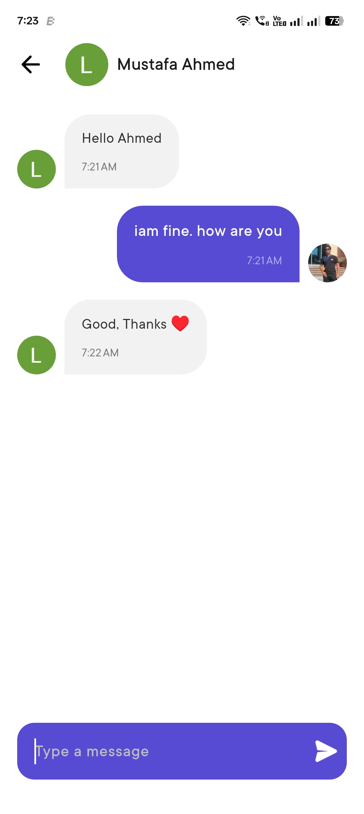
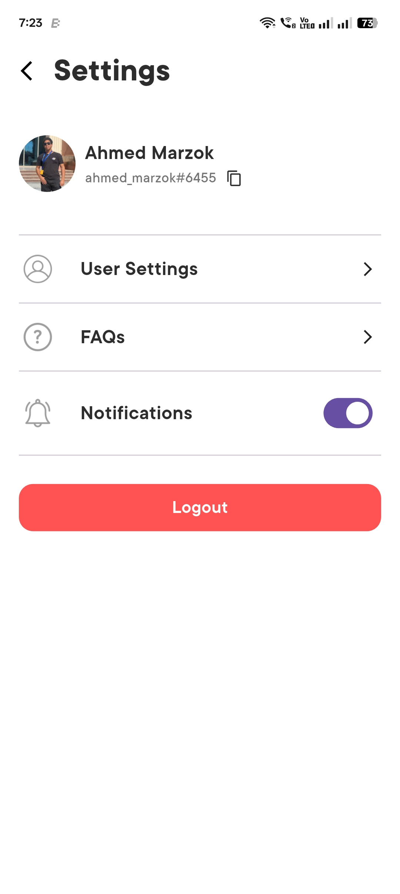
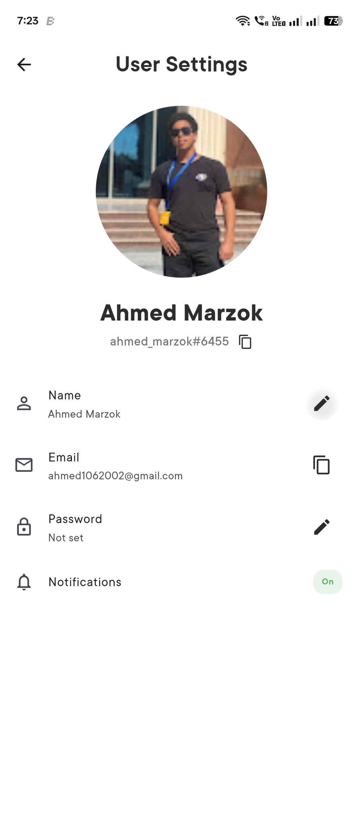

# 💬 ITI Chat App

<div align="center">


**A modern, feature-rich real-time chat application built with Flutter and Firebase**

[Features](#-features) • [Screenshots](#-screenshots) • [Installation](#-installation) • [Usage](#-usage) • [Architecture](#-architecture) • [Contributing](#-contributing)

</div>

---

## 🌟 Features

### 🔐 Authentication

- **Email & Password Authentication** - Secure login and registration
- **Google Sign-In** - One-tap authentication with Google
- **User Profile Management** - Custom display names and profile pictures
- **Password Management** - Set and change passwords with validation

### 💬 Real-time Messaging

- **Instant Messaging** - Real-time chat with Firebase Realtime Database
- **Friend System** - Add friends by ID and manage friend requests
- **Message History** - Persistent chat history with timestamps
- **Image Support** - Send and receive images in conversations
- **Message Status** - Real-time message delivery and read status

### 🎨 User Experience

- **Modern UI/UX** - Clean, intuitive interface with Material Design 3
- **Custom Fonts** - Beautiful typography with TT Commons, Roboto, and Nanami fonts
- **Responsive Design** - Optimized for both Android and iOS
- **Dark/Light Theme Support** - Adaptive theming system
- **Toast Notifications** - User-friendly feedback system

### 🔧 Advanced Features

- **Offline Support** - Works seamlessly with poor connectivity
- **Connectivity Monitoring** - Real-time internet connection status
- **Settings Management** - Customizable app preferences
- **FAQ System** - Built-in help and support
- **Data Persistence** - Local storage with Hive database

---

## 📱 Screenshots

<div align="center">

### Login & Authentication




### Chat Interface




</div>

---

## 🚀 Installation

### Prerequisites

- Flutter SDK (3.8.1 or higher)
- Dart SDK
- Android Studio / Xcode
- Firebase project setup

### Setup Instructions

1. **Clone the repository**

   ```bash
   git clone https://github.com/your-username/iti_chat_app.git
   cd iti_chat_app
   ```

2. **Install dependencies**

   ```bash
   flutter pub get
   ```

3. **Firebase Configuration**

   - Create a new Firebase project at [Firebase Console](https://console.firebase.google.com/)
   - Enable Authentication (Email/Password and Google Sign-In)
   - Enable Realtime Database
   - Download `google-services.json` and place it in `android/app/`
   - Download `GoogleService-Info.plist` and place it in `ios/Runner/`

4. **Run the application**
   ```bash
   flutter run
   ```

---

## 💻 Usage

### Getting Started

1. **Launch the app** and choose your preferred authentication method
2. **Sign up** with email/password or use Google Sign-In
3. **Set your display name** and profile picture
4. **Add friends** by entering their user ID in the "Add Friend" field
5. **Start chatting** by tapping on any friend in your chat list

### Key Features Usage

- **Adding Friends**: Enter friend ID → Tap add button → Wait for acceptance
- **Managing Requests**: Check the "Requests" tab for pending friend requests
- **Sending Messages**: Type in the message field → Tap send button
- **Settings**: Access via the settings icon to manage preferences
- **FAQ**: Get help by accessing the FAQ section

---

## 🏗️ Architecture

This project follows **Clean Architecture** principles with a well-structured codebase:

```
lib/
├── constants/          # App constants (colors, icons, images)
├── core/              # Core functionality
│   ├── auto_route/    # Navigation configuration
│   ├── di/            # Dependency injection
│   └── hive_service.dart
├── data/              # Data layer
│   ├── datasources/   # Remote data sources
│   ├── models/        # Data models
│   └── repositories/  # Repository implementations
├── domain/            # Business logic layer
│   ├── entities/      # Business entities
│   ├── repositories/  # Repository interfaces
│   └── usecases/      # Use cases
└── presentation/      # UI layer
    ├── bloc/          # State management (BLoC pattern)
    ├── pages/         # Screen widgets
    └── widgets/       # Reusable UI components
```

### Key Technologies

- **State Management**: Flutter BLoC pattern
- **Navigation**: Auto Route for type-safe navigation
- **Dependency Injection**: Get It service locator
- **Local Storage**: Hive database
- **Backend**: Firebase (Auth, Realtime Database)
- **HTTP Client**: Dio for API calls
- **Image Handling**: Image Picker for profile pictures

---

## 🛠️ Development

### Project Structure

- **Clean Architecture**: Separation of concerns with clear layer boundaries
- **BLoC Pattern**: Predictable state management
- **Repository Pattern**: Abstract data access layer
- **Dependency Injection**: Loose coupling and testability

### Code Quality

- **Linting**: Flutter lints for code quality
- **Type Safety**: Strong typing with Dart
- **Error Handling**: Comprehensive error management
- **Testing**: Unit and widget tests (expandable)

---

## 📦 Dependencies

### Core Dependencies

- `flutter_bloc` - State management
- `firebase_core` - Firebase integration
- `firebase_auth` - Authentication
- `firebase_database` - Realtime database
- `auto_route` - Navigation
- `get_it` - Dependency injection
- `hive` - Local storage
- `dio` - HTTP client
- `google_sign_in` - Google authentication
- `image_picker` - Image selection
- `connectivity_plus` - Network monitoring

### Development Dependencies

- `build_runner` - Code generation
- `auto_route_generator` - Route generation
- `json_serializable` - JSON serialization
- `freezed` - Immutable classes

---

## 🤝 Contributing

We welcome contributions! Please follow these steps:

1. **Fork the repository**
2. **Create a feature branch** (`git checkout -b feature/amazing-feature`)
3. **Commit your changes** (`git commit -m 'Add amazing feature'`)
4. **Push to the branch** (`git push origin feature/amazing-feature`)
5. **Open a Pull Request**

### Contribution Guidelines

- Follow Flutter/Dart style guidelines
- Write meaningful commit messages
- Add tests for new features
- Update documentation as needed

---

## 📄 License

This project is licensed under the MIT License - see the [LICENSE](LICENSE) file for details.

---

## 👥 Team

**ITI Chat App Development Team**

- Built with ❤️ using Flutter
- Powered by Firebase
- Designed for modern mobile experiences

---

## 🔗 Links

- [Flutter Documentation](https://flutter.dev/docs)
- [Firebase Documentation](https://firebase.google.com/docs)
- [BLoC Pattern](https://bloclibrary.dev/)
- [Clean Architecture](https://blog.cleancoder.com/uncle-bob/2012/08/13/the-clean-architecture.html)

---

<div align="center">

**⭐ Star this repository if you found it helpful!**

Made with Flutter 💙

</div>
